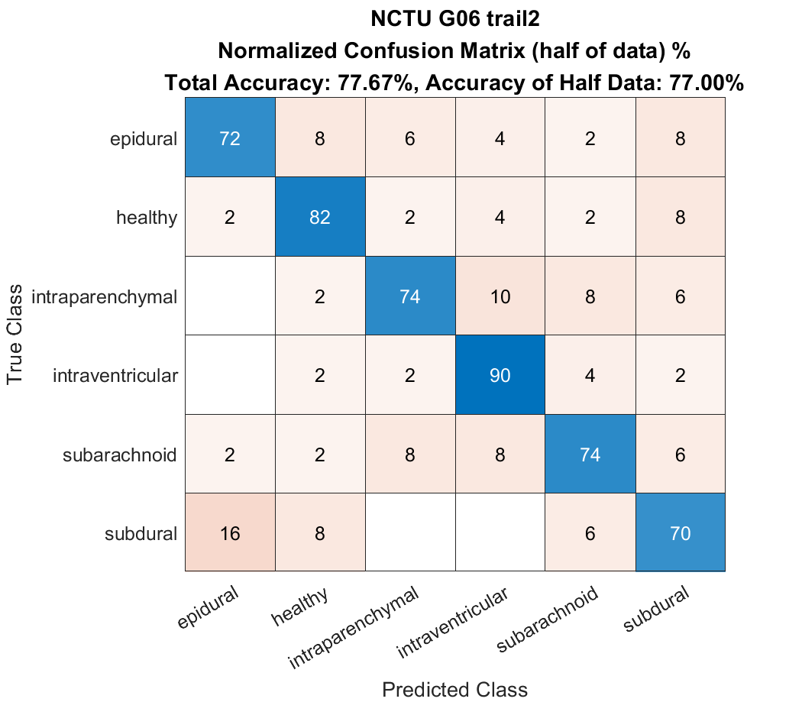

# Digital Medicine
## Case presentation 2: RSNA ICH Detection

- This project is based on [RSNA Intracranial Hemorrhage Detection](https://www.kaggle.com/c/rsna-intracranial-hemorrhage-detection) - [appian42](https://github.com/appian42/kaggle-rsna-intracranial-hemorrhage) ended up at 11th place in Kaggle competition in 2019.


<p float="center">
     
</p>

## Table of Contents

*   [Directory Layout](#directory-layout)
*   [Solution Overview](#solution-overview-and-reference)
*   [How to Run](#how-to-run)
    *   [Requirements](#requirements)
    *   [Preprocessing](#preprocessing)
    *   [Training](#training)
    *   [Predicting](#predicting)
    *   [Second Level Model](#second-level-model)
    *   [Ensembling](#ensembling)


## Directory layout

```
.
├── bin               # Scripts to perform various tasks such as `preprocess`, `train`.
├── conf              # Configuration files for classification models.
├── model             # Where classification model outputs are saved.
├── meta              # Where second-level model outputs are saved.
├── src               # Main source code
 └── preprocess       # Preprocess raw data into trainable image. 
│      ├── preprocess 
│      │      ├── CSV_Gernerator-Train.ipyb
│      │      ├── CSV_Gernerator-Test.ipyb
│      │      ├── Prediction.ipyb
│      └──    └── stage_2_train.csv   # Download from Kaggle.
├── TotalData     # Training data provided in class. 
└── TestingData   # Testing data provided in class. 
```

Missing directories will be created when `./bin/preprocess.sh` is run.


## Solution Overview and Reference

- https://www.kaggle.com/c/rsna-intracranial-hemorrhage-detection/discussion/117330
- https://www.kaggle.com/c/rsna-intracranial-hemorrhage-detection/discussion/118249


## How to run

Please download `/TotalData` & `/TestingData` directory from [Drive](https://drive.google.com/drive/folders/1QP0CcygM4oeoY8pfVsBQcjQAI9pAmsAa?usp=sharing) and put them in the root level and unzip.

Please download `stage_2_train.csv` from [Drive](https://drive.google.com/drive/folders/1QP0CcygM4oeoY8pfVsBQcjQAI9pAmsAa?usp=sharing) and put it in `./src/preprocess/`

Please make sure you run each of the scripts from parent directory of `./bin`.


### Requirements

The library versions we used. It does not mean other versions can not be used but not tested.

- Python 3.6.6
- CUDA 10.0 (CUDA driver 410.79)
- [Pytorch](https://pytorch.org/) 1.1.0
- [NVIDIA apex](https://github.com/NVIDIA/apex) 0.1 (for mixed precision training)

```
pip install -r requirements.txt
```
### Preprocessing

run [CSV_Gernerator-Train.ipyb]()


- [dicom_to_dataframe.py](./src/preprocess/dicom_to_dataframe.py) reads dicom files and save its metadata into the dataframe.
- [create_dataset.py](./src/preprocess/create_dataset.py) creates a dataset for train/test.
- [make_folds.py](./src/preprocess/make_folds.py) makes folds(n=1) for cross validation(option). 


### Training

~~~
$ sh ./bin/train.sh
~~~

- Trains two types of models `se_resnext50_32x4d` and `se_resnext101_32x4d`. 

### Hyperparameters


| Hyperparameter | value | 
| -------- | -------- | 
| Batch     | 28     | 
| Loss function     | BCEWithLogitsLoss     | 
| Optimizer     | Adam     | 
| Learning rate     | 1e-4     | 
| Lr_decay     | 0.4     | 
| Epoch     | 4     | 


### Predicting

run [CSV_Gernerator-Test.ipyb]() and 
run [Predict.ipyb]()

- Makes predictions for test data.
- Checkpoints 3rd epoch of each fold is used for predictions.


### Second level model

~~~
$ sh ./bin/predict_meta.sh
~~~

- Ensembles out-of-fold predictions from the previous step (used as meta-features to construct train data).
- Ensembles test predictions from the previous step (used as meta-features to construct test data).
- Trains `LightGBM`, `Catboost` and `XGB` with 8 folds each.
- Predicts on test data using each of the trained models.


### Ensembling

~~~
$ sh ./bin/ensemble.sh
~~~

- Ensembles predictions from the previous step.
